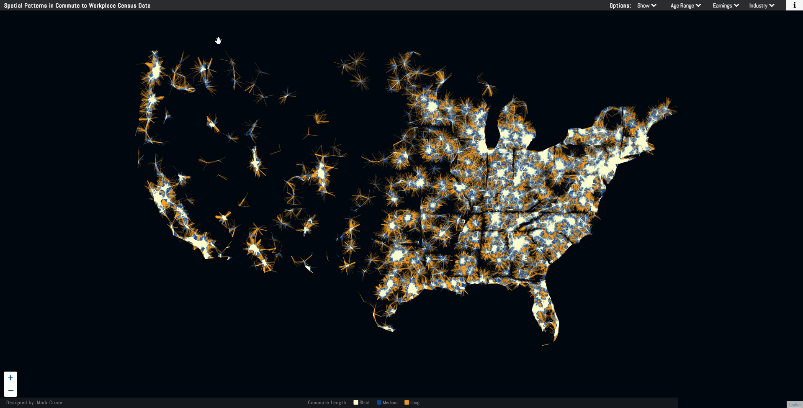
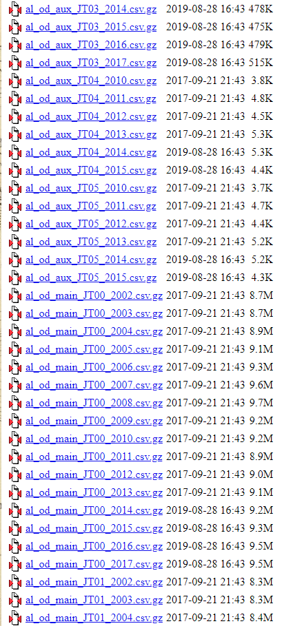
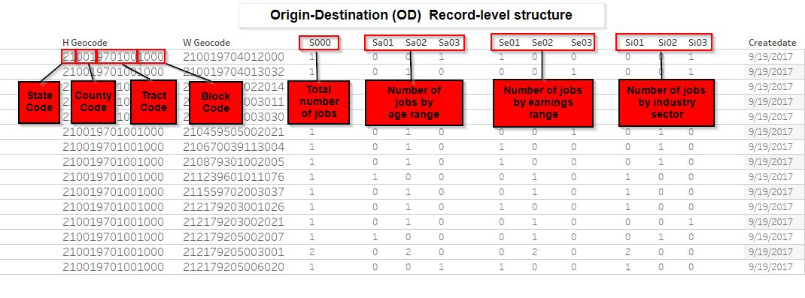
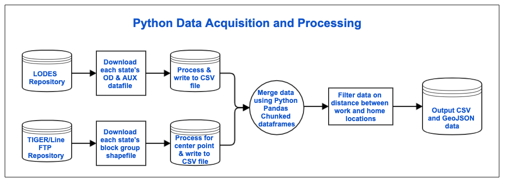
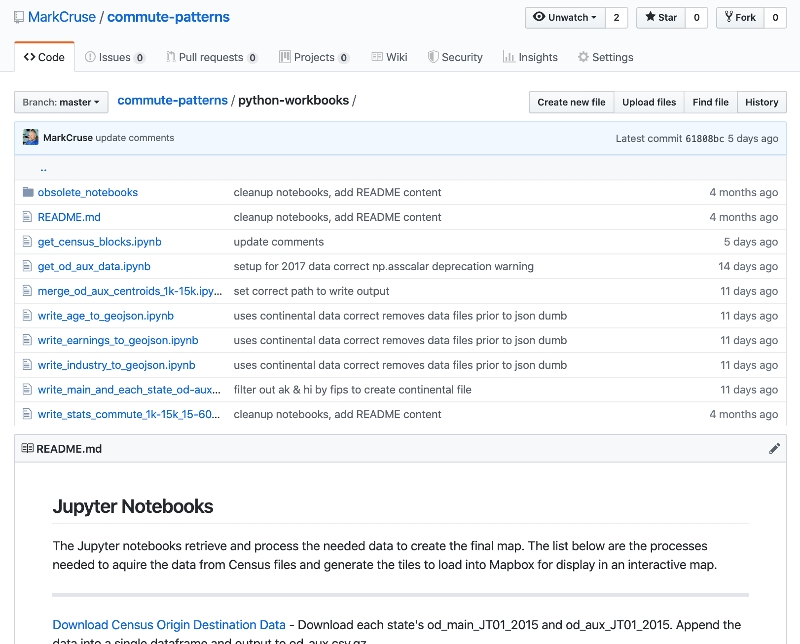

----?image=presentation/images/joe_madden_quote.jpg
@title[Joe quote]
---
@title[Me & Repo]

### Mark Cruse

Github repo:  
@color[#e49436](@size[.9em](github.com/markcruse/commute-patterns))

Presentation:  
@color[#e49436](@size[.9em](bit.ly/commute-patterns-presentation))  

@div[left-50 map-full fragment]

@divend
@div[right-50 map-full fragment]

@divend
---
@title[Introduction]
@snap[north headline span-100]
@css[heading](Commute Patterns in <br> Census Origin to Destination Data)
@snapend

+++
@title[Intro-sub1]
@snap[north headline span-100]
@css[heading](Commute Patterns in <br> Census Origin to Destination Data)
@snapend

@snap[midpoint span-100]
@color[#e49436](@size[.9em](<center>Processing and transforming Census Bureau data to provide insight into commuters' residence, workplace, earnings, age ranges, and industry type.))
@snapend

+++
@title[Intro-sub2]
@snap[north headline span-100]
@css[heading](@size[0.6em](Commute Patterns in Census Origin to Destination Data))
@snapend

@snap[midpoint map-full span-100]

@snapend

@snap[south byline span-100]
Processing and transforming Census Bureau data to provide insight into commuters' residence, workplace, earnings, age ranges, and industry type.
@snapend

+++?image=presentation/images/map_to_age_29.png
@title[Map Full Screen]
  
+++?image=presentation/images/map_age_menu.png
@title[Map Full Age Menu]

+++?image=presentation/images/map_earnings_menu.png
@title[Map Full Earnings Menu]

+++?image=presentation/images/map_industry_menu.png
@title[Map Full Industry Menu]

+++?image=presentation/images/map_show_background_map.png
@title[Map Full Map with Background]

+++?image=presentation/images/map_show_background_map_labels-min.png
@title[Map Full Map with Background & Labels]

+++?image=presentation/images/map_tacoma_area.png
@title[Map Zoom to Tacoma]

---?image=presentation/images/map_to_age_29.png&size=cover&opacity=50

@title[the map is not the end result]

#### How did I do that?

----?image=presentation/images/map_inspect.png&size=cover&opacity=50
@title[the map is not the end result]

@snap[midpoint span-100]
<br>
@ul
Easy enough with this webpage to inspect/view:
 - Page Source
 - CSS 
 - JavaScript 
 - Mapbox Data
@ulend
@snapend

---?image=presentation/images/map_to_age_29.png
Note:
- I knew when I started my project a map like this was possible
- But where do I get the data?
- Lets rewind to the beginning

---?image=presentation/images/map_to_age_29.png&size=cover&opacity=50
@title[Project GoalsS]
#### Project Goals
@ul
- Create a visually appealing map
- Large amount of data to process
- A process complex enough that warrant documenting
- Effort will help others do more detailed analysis with data
@ulend

--- 
@title[Source of Data]
@snap[west]
Data Source
@snapend
@snap[east span-60]

@snapend
@snap[south text-center]
https://lehd.ces.census.gov/
@snapend

+++ 
@title[Source of Data]
@snap[west span-60 lodes-details]
LODES is a part of the Longitudinal Employer-Household Dynamics data products from the U.S. Census Bureau.  

@snapend

@snap[east span-40]

@snapend

+++ 
@title[Source of Data]
@snap[west span-60 lodes-details]
@css[gray-it](LODES is a part of the Longitudinal Employer-Household Dynamics data products from the U.S. Census Bureau.)  
<br>
LODES consist of, the Unemployment Insurance earnings data and Quarterly Census of Employment and Wages data from States are combined with administrative data, census data, and American Community Survey (ACS) data.  
<br>

@snapend

@snap[east span-40]

@snapend

+++ 
@title[Source of Data]
@snap[west span-60 lodes-details]
@css[gray-it](LODES is a part of the Longitudinal Employer-Household Dynamics data products from the U.S. Census Bureau.)  
<br>
@css[gray-it](LODES consist of, the Unemployment Insurance earnings data and Quarterly Census of Employment and Wages data from States are combined with administrative data, census data, and American Community Survey data.)  
<br>
LODES data series, helps users understand, analyze, and visualize where people work and where workers live.  
<br>
https://lehd.ces.census.gov/
@snapend

@snap[east span-40]

@snapend

+++   
@title[Types of OD datasets]
@snap[west span-60 lodes-details]        
#### 2 types of Origin-Destination (OD) datasets  

@css[gray-it](<u>__Main__</u>)  
Jobs of workers who are employed in the state and reside in the state.  
<br> 
@css[gray-it](<u>__Aux__</u>)  
Jobs of workers who are employed in the state and reside out of state.  
@snapend

@snap[east span-40]

@snapend

+++
@title[Types of OD datasets cont]
@snap[west span-60 lodes-details]        
__Additional files within the main and aux <br> files describe the type of jobs:__  
<br>
__JT00__ - All Jobs  
__JT01__ - Primary Jobs  
__JT02__ - All Private Jobs  
__JT03__ - Private Primary Jobs  
__JT04__ - All Federal Jobs  
__JT05__ - Federal Primary Jobs  
@snapend

@snap[east span-40]

@snapend

+++?image=presentation/images/map_to_age_29.png&size=cover&opacity=50
<center>OD & AUX records with JT01 - Primary Jobs</center>
<br>

+++
@snap[midpoint span-100]

@snapend
Note:
- The data is very detailed and will requeire some aggregation
- For lines we will need to establish points related to the Block Group
- for both the work location and home location

---
@title[Data Wrangling Tools]
@snap[north map-full span-100]
Data Wrangling Tools

@snapend
@snap[south map-full span-40]

@snapend

+++
@title[Workflow]
@snap[north map-full span-100]
Data Workflow

@snapend
+++
@title[Workflow]
@snap[north img-blur span-90]
@css[gray-it](Data Workflow)

@snapend
@snap[south map-full span-80]
Python Libraries

@snapend
---
@title[Jupyter Notebooks]

@snap[north span-100]
##### Jupyter Notebooks  
<br>
@snapend

@snap[midpoint map-full span-80]
<br> 

@snapend

---
@title[get_census_blocks.ipynb]

@snap[north span-100]
##### get_census_blocks.ipynb
@snapend

@snap[south span-100 text-10]
@[1-4,6](Establish connect with ftp site, <br>create list of files  on ftp site)
@[11-12,14](Loop through list of files in the ftp site <br>  )
@[29](Call function to uncompress zip)
@[73-75](Uncompress downloaded zip files)
@[31-33](Assign file handles to contents of shapefile)
@[42-43](Call function to create geo dataframe)
@[78-82](Set Lat/Lon data type to float)
@[45-46](Call function to append the geodataframe to a list)
@[84-87,90-92](Function that appends each block group centroid to list)
@[48-56](Remove files from temp directory)

@snapend

``` python
# Establish FTP connection with Census Bureau
ftp = FTP('ftp2.census.gov')
ftp.login()
ftp.cwd('geo/tiger/TIGER2018/TABBLOCK/')

file_list = ftp.nlst()  #list of files in ftp dir

# print a list of all files in the FTP folder
print(file_list)

# Loop through the ftp files, download, extract, 
# load, and save
​
for index, zip_filename in enumerate(file_list):
    
    # create a file path for the download
    zip_path_file = ftpTmp.joinpath(file_list[index])
    
    # write download file to storage area
    fh = open (zip_path_file, "wb")
    print ("STARTED download for file: " + zip_filename)
    ftp.retrbinary("RETR " + zip_filename, fh.write)
    
    # open downloaded file for exdf
    fh = open(zip_path_file, "rb")
    zp = zipfile.ZipFile(fh)
    
    # call df function
    extract_files(zip_path_file)
    
    # assign file handles to each of the files extracted
    cpg, dbf, prj, shp, xml1, xml2, shx = [filename for 
        filename in zp.namelist()]
    
    fh.close
    zp.close
    print(shp)
    
    # add a path to the shapefile
    shape_file = ftpTmp.joinpath(shp)
    
    # call function to create a geodataframe
    df_gdf = get_data(shape_file)
    
    # call function to append the geodataframe to a list
    count_records = append_list(df_gdf, count_records)
    
    #removes files from temp directory
    zip_path_file.unlink()
    shape_file.unlink()
    file_to_rem = ftpTmp.joinpath(cpg)
    file_to_rem.unlink()    
    file_to_rem = ftpTmp.joinpath(dbf)
    file_to_rem.unlink()    
    file_to_rem = ftpTmp.joinpath(xml1)
    file_to_rem.unlink()    
    file_to_rem = ftpTmp.joinpath(xml2)
    file_to_rem.unlink()    
    file_to_rem = ftpTmp.joinpath(shx)
    file_to_rem.unlink()    
    file_to_rem = ftpTmp.joinpath(prj)
    file_to_rem.unlink()
​
    # get the current time on timer
    stop = timeit.default_timer()
    
    #create a numpy array to calculate time
    timer = np.array([(stop-start)/60])
    # call function to calculate minutes and seconds
    min_sec = get_time(timer)
    minutes, seconds = min_sec[0], min_sec[1]
    
def extract_files(zip_path_file):
    unpack_archive(str(zip_path_file), 
        extract_dir=str(ftpTmp))
    fh.close()
    
def get_data(filename):
  gdf = gpd.read_file(filename, 
   dtype={'GEOID10': 'object', 'INTPTLAT10': 'float', 
   'INTPTLON10': 'float'})
return gdf

def append_list(df_gdf, count_records):
    #keep only the rows that are not water
    df_gdf = df_gdf.drop(df_gdf[(df_gdf['AWATER10'] > 0) 
        & (df_gdf['ALAND10'] == 0)].index)
     
    #exclude Puerto Rico and island areas
    if str(df_gdf['STATEFP10'].unique()[0]) in st_list:
        df_list.append(df_gdf)
        count_records = count_records+len(df_gdf)
              
    # drop the columns that are not needed
    cols=['STATEFP10','COUNTYFP10','TRACTCE10','BLOCKCE10',
        'NAME10','MTFCC10','UR10','UACE10','UATYPE',
        'FUNCSTAT10','ALAND10','AWATER10','geometry']
    df_gdf.drop(cols, axis=1, inplace=True)
    # rename columns
    df_gdf.rename(columns={'GEOID10': 'block_geoid', 
        'INTPTLAT10': 'lat', 'INTPTLON10': 'lon'}, 
        inplace=True)

    return count_records
    
    
```
+++
Processing Complete
Total time: 268 minutes 11 seconds

Total count: 10,549,216

---
@title[get_od_aux_data.ipynb]

@snap[north span-100]
##### get_od_aux_data.ipynb
@snapend

@snap[south span-100 text-10]
@[1-10](Request OD records from http site)
@[11-17](Check if files exist; write to dataframe)
@[18-22](Function to open CSV and create dataframe)
@[23-26](Append dataframe to list)

@snapend
``` python
state_list = ['ak','al', 'ar', 'az', 'ca', 'co', 'ct', 'dc', 'de', 'fl', 'ga', 'ia', 'id', 'il', 'in', 'ks',
              'ky', 'la', 'ma', 'md', 'me', 'mi', 'mn', 'mo', 'ms', 'mt', 'nc', 'nd', 'ne', 'nh', 'nj', 'nm', 'nv',
              'ny', 'oh', 'ok', 'or', 'pa', 'ri', 'sc', 'sd', 'tn', 'tx', 'ut', 'va', 'vt', 'wa', 'wi', 'wv','wy']
# Loop through each state, download the compressed file, extract data, append to CSV
​
for st in state_list:
 # file and path of download
 filename = 'https://lehd.ces.census.gov/data/lodes/LODES7/'
  + st + '/od/' + st + '_od_main_JT01_'+ year +'.csv.gz'
 filecheck = requests.get(filename)  #check if file exists on census.gov
    
if not filecheck:
    print (st.upper(),' - Does NOT Exist')
    continue
else:
    # call function to load compressed data into dataframe
    df = get_data(filename, counter)
     def get_data(filename, counter):
        print ('\nCurrently processing #', counter, filename)
        dataframe = pd.read_csv(filename, dtype=str)
     return dataframe
​
    # append df to list before next state overwrites df
    df_list.append(df)
    valid_state_list.append(st)
    print('\nStates processed: ',[x.upper() for x in valid_state_list])
    
for st in valid_state_list:
    # file and path of download
    filename = 'https://lehd.ces.census.gov/data/lodes/LODES7/'+ st + '/od/' + st + '_od_aux_JT01_' + year + '.csv.gz'
    #https://lehd.ces.census.gov/data/lodes/LODES7/ak/od/ak_od_aux_JT01_2015.csv.gz
    
    # call function to load compressed data into dataframe
    df = get_data(filename, counter)
    
    # append df to list before next state overwrites df
    df_list.append(df)
​
print('\n\nStates with missing OD & AUX data: ',list(set(state_list)-set(valid_state_list)))
```

+++
All state files retrieved. Total time: 23 minutes 46 seconds   

Total number of records: 117,907,270


States with missing OD & AUX data:  ['ak', 'sd']
---
@title[merge_od_aux_centroids_1k-15k.ipynb]

@snap[north span-100]
##### merge_od_aux_centroids_1k-15k.ipynb
@css[doclink]Funtion to process chunk data on distance
@snapend

``` python
def chunk_process_distance(df):
  # create a group of all workplace geoids
  df_group = df.groupby(['w_geocode']).sum()

  # create a dataframe with only blocks with 1000+ employees
  df_group_limited = df_group[(df_group['S000'] >= 1000) 
    & (df_group['S000'] < 15000)]

  # merge the centroid data frame with the grouped dataframe
  merge_result = pd.merge(df2, centroids,
    left_on=  ['w_geocode'],right_on= ['block_geoid'],
        how = 'left')

  merge_result.rename(columns={'lat': 'w_lat', 'lon': 'w_lon'},
         inplace=True)

  # merge the centroid data frame on the h_geocode column
  merge_result = pd.merge(merge_result, centroids,
    left_on= ['h_geocode'],right_on= ['block_geoid'],how = 'left')
    
  merge_result.rename(columns={'lat': 'h_lat', 'lon': 'h_lon'}, inplace=True)
  
  merge_result['distance'] = Distance(merge_result['w_lat'].tolist(),
        merge_result['w_lon'].tolist(),merge_result['h_lat'].tolist(),
            merge_result['h_lon'].tolist())

  merge_result['distance'] = merge_result['distance'].apply(lambda x: round(x, decimals))

return merge_result
```
---
@title[merge_od_aux_centroids_1k-15k-2.ipynb]

@snap[north span-100]
##### merge_od_aux_centroids_1k-15k.ipynb
@css[doclink]Read the data in chunks.
@snapend

``` python
#Load the centroid file to dataframe for merging
centroids = pd.read_csv(block_file, 
    dtype={'block_geoid': 'object', 'lat': 'float', 
            'lon': 'float'})

#Read the Origin Destination (OD) data into chunk dataframes
df_chunk = pd.read_csv(OD_file, compression='gzip', 
    dtype={'w_geocode': str,'h_geocode':str}, 
        chunksize=10000000)

chunk_list = []

wgs84_geod = Geod(ellps='WGS84') 
#Distance will be measured on this ellipsoid
# more accurate than a spherical method

chunk_num = 1
decimals = 0   

print('Reading in the chunk dataframe')
start = timeit.default_timer()
for df in df_chunk:
    print('Starting processing for chunk #', chunk_num)

    # call function to group and filter the data 
    filter_chunk = chunk_process_distance(df)
    # append the filtered data to list
    chunk_list.append(filter_chunk)

print('\nData merge complete.')
```
---
@title[write_age_to_geojson.ipynb]

@snap[north span-100]
##### write_age_to_geojson.ipynb
@css[doclink]Create a LineString Geometry
@snapend


```python
df['geometry'] = df.apply(lambda x: 
    geom.LineString([(x['w_lon'], x['w_lat'] ), 
        (x['h_lon'],x['h_lat'])]), axis = 1)
print ('\nLineString geometries created.')
df['geometry'] = df.apply(lambda x: 
        geom.LineString([(x['w_lon'], 
        x['w_lat'] ), (x['h_lon'],
        x['h_lat'])]), axis = 1)

# Write the GeoDataFrames to JSON
gdf_age1_short = gp.GeoDataFrame(age1_short, 
        geometry='geometry')
gdf_age1_medium = gp.GeoDataFrame(age1_medium, 
        geometry='geometry')
gdf_age1_long = gp.GeoDataFrame(age1_long, 
        geometry='geometry')

output = 'age1_short.json'
out_path_file = ODpath.joinpath(output)
gdf_age1_short.to_file(out_path_file, 
        index=None, driver='GeoJSON')
​
```
+++
The number of records written to age1_short geo dataframe: 568,547

The number of records written to age1_medium geo dataframe: 550,931

The number of records written to age1_long geo dataframe: 682,867
+++
The number of records written to age2_short geo dataframe: 1,763,154  

The number of records written to age2_medium geo dataframe: 1,705,855  

The number of records written to age2_long geo dataframe: 1,818,050  
+++
The number of record written to age3_short geo dataframe: 680,758

The number of records written to age3_medium geo dataframe: 640,971

The number of records written to age3_long geo dataframe: 709,274  

---
#### Next steps
@ul 
- Still too much data
- GeoJSON to large to import in Mapbox Studio
- Need to create a tilesets
- Tippecanoe
- https://docs.mapbox.com/help/troubleshooting/large-data-tippecanoe/
@ulend

+++
#### Shell script to process the GeoJSON to mbtiles
```
echo 'age1_short'
tippecanoe -o age1_short.mbtiles -zg --drop-densest-as-needed age1_short.json
echo 'age1_medium'
tippecanoe -o age1_medium.mbtiles -zg --drop-densest-as-needed age1_medium.json
echo 'age1_long'
tippecanoe -o age1_long.mbtiles -zg --drop-densest-as-needed age1_long.json

echo 'age2_short'
tippecanoe -o age2_short.mbtiles -zg --drop-densest-as-needed age2_short.json
echo 'age2_medium'
tippecanoe -o age2_medium.mbtiles -zg --drop-densest-as-needed age2_medium.json
echo 'age2_long'
tippecanoe -o age2_long.mbtiles -zg --drop-densest-as-needed age2_long.json

echo 'age3_short'
tippecanoe -o age3_short.mbtiles -zg --drop-densest-as-needed age3_short.json
echo 'age3_medium'
tippecanoe -o age3_medium.mbtiles -zg --drop-densest-as-needed age3_medium.json
echo 'age3_long'
tippecanoe -o age3_long.mbtiles -zg --drop-densest-as-needed age3_long.json	
```

---
#### Final Steps and Future Talks
@ul
- Upload mbtiles to Mapbox
- Javascript
- Leaflet VectorGrid
- Regionalize data
@ulend

---?image=presentation/images/map_to_age_29.png&size=cover&opacity=50
@title[the map is not the end result]

### Mark Cruse
Github repo:  
@color[#e49436](@size[.9em](github.com/markcruse/commute-patterns))

Presentation:  
@color[#e49436](@size[.9em](bit.ly/commute-patterns-presentation))

Map:  
@color[#e49436](@size[.9em](bit.ly/commute-patterns-map))

@css[doclink](@WaywardMark)  
@css[doclink](mark.cruse@gmail.com)

@snapend