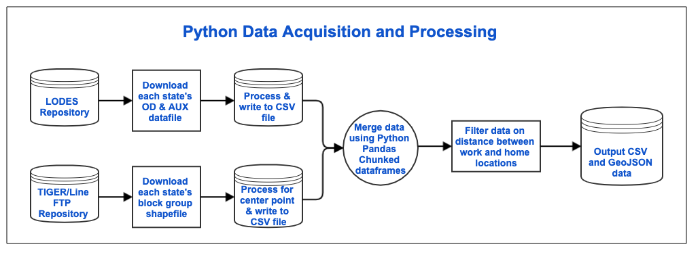

## Spatial Patterns in Commute to Workplace
#### Using Census Bureau LEHD Origin-Destination Employment Statistics
****

#### I. Introduction  

This project is about discovering new insight into the communities in which we live and the communities where we work. Some cities of the United States have already seen a transformation of becoming the location of peoples residence as well as the location of their work. This is a significant shift from 30 years ago when some predicted that commuting to work would be a thing of the past with the advent of the Internet. 'Everyone would work from home' is what the prognosticators told us. However, that has not happened and parts of the country experience commute times well over an hour. The intention of the project is to devise a process to capture data from the census data and produce maps that provide insight into the commute patterns between residence and workplace. 

Commuting patterns and workplace employment data have a broad interest group including urban and regional planners, social science and transportation researchers, and businesses. 

#### II. Methodology  
 The U.S. Census Bureau (CB) collects national information that shows the significance and relationships of home to work transportation flows. The data are described below.

__A. Data__   

The Local Employment Dynamics Partnership (LED) provides detail data about America’s jobs, workers, and local economies. 'LED integrates existing data from state-supplied administrative records on workers and employers with existing censuses, surveys, and other administrative records to create a longitudinal data system on U.S. employment.'1 Methods in assimilating the data protect the confidentiality of respondents and allow the data to maintain the integrity to a local level for public consumption.    

LEHD Origin-Destination Employment Statistics (LODES) provides annual employment statistics linking home and work locations at the census block-level. The LEHD combines federal, state and Census Bureau data on employers and employees. The LEHD data depends upon state unemployment insurance records and tabulates the count of jobs by census block.  

[More information for the data discovery process here.](./data-discovery/README.md)

The [LODES](https://lehd.ces.census.gov/data/#lodes) dataset is the data foundation for this project.  Within LODES this project focuses on the Primary Jobs subset of LODES (JT01 job types). 2015 is the latest data set.  LODES data does not contain any geographic information, therefore is it essential to download the census block Shapefiles from [TIGER/Line](https://www.census.gov/geo/maps-data/data/tiger-line.html). The LODES data and shapefiles are then merged using the GEOID.  

The individual state LODES and TIGER/Line data are extracted using Python. Since shapefiles are rather large, Python code has been designed to download, extract, and save only the centroid coordinate information from the shapefiles. The Python code also reduces the precision of the geometry to save additional storage space. The data from LODES and the shapefiles are merged together to give the workplace location and place of residence a geographic coordinate.

The main LODES dataset is also extracted and processed directly from the website. The large file is then processed and analyzed in Python using [Pandas dataframes](https://en.wikipedia.org/wiki/Pandas_(software)) and [Dask dataframes](http://docs.dask.org/en/latest/dataframe.html).  The processing aggregates the data to be generated for maps and data visualizations.  

#### Python Jupyter Lab notebooks 

The notebooks described in the [python workbooks folder](./python-workbooks/README.md) document the steps to take to download, process, transform and load the data to create an interactive map.

#### Data Information
The [data discovery](./data-discovery/README.md) processes are identified in this section of the repository.

1[LED New Data from the States and the U.S. Census Bureau](https://lehd.ces.census.gov/doc/LEDonepager.pdf)

