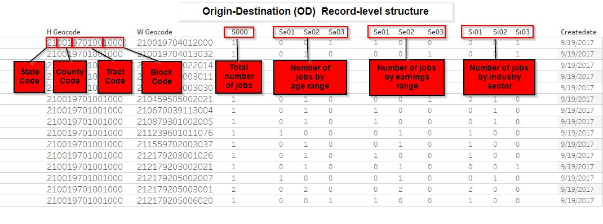
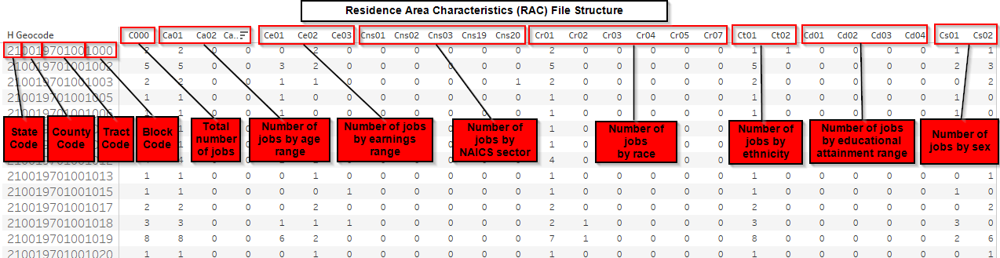
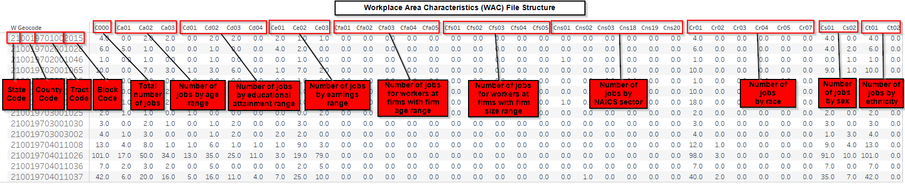

## Data Discovery  
The purpose of this README file is to document the data discovery process in creating the Spatial Patterns in Commute to Workplace project.

### Table of Contents
 - [Data Groups of LODES data files](#Data-Groups-of-LODES-data-files)
 - [Data Download Primary Dataset](#Data-Download-Primary-Dataset)
 - [Data File Naming Convention](#Data-File-Naming-Convention)
   - [Origin-Destination (OD) Dataset](#Origin-Destination-OD-Dataset)
   - [Residence Area Characteristics (RAC) Dataset ](#Residence-Area-Characteristics-RAC-Dataset)
   - [Workplace Area Characteristics (WAC) Dataset](#Workplace-Area-Characteristics-WAC-Dataset)
 - [File Structures](#File-Structures)
   - [Origin-Destination (OD) File Structure](#Origin-Destination-OD-File-Structure)
   - [Residence Area Characteristics (RAC) File Structure](#Residence-Area-Characteristics-RAC-File-Structure)
   - [Workplace Area Characteristics (WAC) File Structure](#Workplace-Area-Characteristics-WAC-File-Structure)
 - [Informational Sources](#Informational-Sources)
 - [Additional Data Sources](#Additional-Data-Sources)

#### Data Groups of LODES data files
    - Origin-Destination (OD) data
    - Residence Area Characteristic (RAC) data
    - Workplace Area Characteristic (WAC) data

#### Data Download Primary Dataset
[https://lehd.ces.census.gov/data/#lodes]( https://lehd.ces.census.gov/data/#lodes)

__JT01__ job types (Primary Jobs) will be use during this analysis.  
__2015__ data is the most current LODES data. This year will be used for the analysis.  

__LODES Version 7.3 is based on 2016 TIGER/Line shapefiles.__  The data are enumerated with 2010 census blocks and tracts census information.  
[TIGER/Line](www.census.gov/geo/maps-data/data/tiger-line.html) data products and [LEHD](lehd.ces.census.gov/applications/help/onthemap.html#!geographic_data) information on how LEHD sources its geography information.   

[Top](#Data-Discovery)

### Data File Naming Convention
#### Origin-Destination (OD) Dataset 
Filenames of the OD datasets are described by the following template:  
- [ST]_od_[PART]_[TYPE]_[YEAR].csv.gz  
- [ST] = lowercase, 2-letter postal code for a chosen state  
- [PART] = Part of the state file, can have a value of either “main” or “aux”. Complimentary parts of the state file, the main part includes jobs with both workplace and residence in the state and the aux part includes jobs with the workplace in the state and the residence outside of the state.  
- [TYPE] = Job Type, can have a value of “JT00” for All Jobs, “JT01” for Primary Jobs, “JT02” for All Private Jobs, “JT03” for Private Primary Jobs, “JT04” for All Federal Jobs, or “JT05” for Federal Primary Jobs.  
- [YEAR] = Year of job data. Can have the value of 2002-2014 for most states. 
As an example the OD file of 'main part' jobs with Primary Jobs would be the file: ky_od__JT01_2015.csv.gz  

[Top](#Data-Discovery)

#### Each record in the OD files contains  
The following columns which coorespond to files in the RAC and WAC worforce segments datasets  
__S000__ Total number of jobs  
__SA01__ Number of jobs of workers age 29 or younger*  
__SA02__ Number of jobs for workers age 30 to 54*  
__SA03__ Number of jobs for workers age 55 or older*  
__SE01__ Number of jobs with earnings $1250/month or less  
__SE02__ Number of jobs with earnings $1251/month to $3333/month  
__SE03__ Number of jobs with earnings greater than $3333/month  
__SI01__ Number of jobs in Goods Producing industry sectors  
__SI02__ Number of jobs in Trade, Transportation, and Utilities industry sectors  
__SI03__ Number of jobs in All Other Services industry sectors  
* For the 2012 data year and later, the job frame has been constrained to include only workers age 14 to 99, so that the youngest age group becomes 14 to 29 and the oldest age group becomes 55 to 99.  

[Top](#Data-Discovery)

#### Residence Area Characteristics (RAC) Dataset  
Filenames of the RAC datasets are described by the following template:  
[ST]_rac_[SEG]_[TYPE]_[YEAR]_1.csv.gz where  
[ST] = lowercase, 2-letter postal code for a chosen state  
[SEG] = Segment of the workforce, can have the values of “S000”, “SA01”, “SA02”, “SA03”, “SE01”, “SE02”, “SE03”, “SI01”, “SI02”, or “SI03”. These correspond to the same segments of the workforce as are listed in the OD file structure above.  
[TYPE] = Job Type, can have a value of “JT00” for All Jobs, “JT01” for Primary Jobs, “JT02” for All Private Jobs, “JT03” for Private Primary Jobs, “JT04” for All Federal Jobs, or “JT05”  for Federal Primary Jobs.  
[YEAR] = Year of job data. Can have the value of 2002-2015 for most states.  
As an example the RAC file of Primary Jobs for workers age 29 or younger in 2015 for Kentucky would be the file: ky_rac_SA01_JT01_2015.csv.gz

[Top](#Data-Discovery)

#### Workplace Area Characteristics (WAC) Dataset
Filenames of the WAC datasets are described by the following template:  
[ST]_wac_[SEG]_[TYPE]_[YEAR].csv.gz where  
[ST] = lowercase, 2-letter postal code for a chosen state  
[SEG] = Segment of the workforce, can have the values of “S000”, “SA01”, “SA02”, “SA03”, “SE01”, “SE02”, “SE03”, “SI01”, “SI02”, or “SI03”. These correspond to the same segments of the workforce as are listed in the OD file structure above.  
[TYPE] = Job Type, can have a value of “JT00” for All Jobs, “JT01” for Primary Jobs, “JT02” for All Private Jobs, “JT03” for Private Primary Jobs, “JT04” for All Federal Jobs, or “JT05” for Federal Primary Jobs.  
[YEAR] = Year of job data. Can have the value of 2002-2015 for most states.  
As an example the WAC file of Primary Jobs for workers earning more that $3333/mo in 2015 for Kentucky would be the file: ky_wac_SE03_JT01_2015.csv.gz  

[Top](#Data-Discovery)

#### Files downloaded for intial analysis  
All JT01 - Primary Job

ky_od_aux_JT01_2015.csv.gz  
ky_od_main_JT01_2015.csv.gz  
ky_rac_S000_JT01_2015.csv.gz  
ky_rac_SA01_JT01_2015.csv.gz  
ky_rac_SA02_JT01_2015.csv.gz  
ky_rac_SA03_JT01_2015.csv.gz  
ky_rac_SE01_JT01_2015.csv.gz  
ky_rac_SE02_JT01_2015.csv.gz  
ky_rac_SE03_JT01_2015.csv.gz  
ky_rac_SI01_JT01_2015.csv.gz  
ky_rac_SI02_JT01_2015.csv.gz  
ky_rac_SI03_JT01_2015.csv.gz  
ky_wac_S000_JT01_2015.csv.gz  
ky_wac_SA01_JT01_2015.csv.gz  
ky_wac_SA02_JT01_2015.csv.gz  
ky_wac_SA03_JT01_2015.csv.gz  
ky_wac_SE01_JT01_2015.csv.gz  
ky_wac_SE02_JT01_2015.csv.gz  
ky_wac_SE03_JT01_2015.csv.gz  
ky_wac_SI01_JT01_2015.csv.gz  
ky_wac_SI02_JT01_2015.csv.gz  
ky_wac_SI03_JT01_2015.csv.gz  

[Top](#Data-Discovery)

### File Structures
#### Origin-Destination (OD) File Structure

| Pos | Variable | Type | Explanation |
| --- | -------- | ---- | ------------|
|1 | w_geocode | Char15 | Workplace | Census Block Code|
|2 | h_geocode | Char15 | Residence Census Block Code|
|3 | S000 | Num | Total number of jobs|
|4 | SA01 | Num | Number of jobs of workers age 29 or younger1|
|5 | SA02 | Num | Number of jobs for workers age 30 to 541|
|6 | SA03 | Num | Number of jobs for workers age 55 or older1|
|7 | SE01 | Num | Number of jobs with earnings $1250/month or less|
|8 | SE02 | Num | Number of jobs with earnings $1251/month to $3333/month|
|9 | SE03 | Num | Number of jobs with earnings greater than $3333/month|
|10 | SI01 | Num | Number of jobs in Goods Producing industry sectors|
|11 | SI02 | Num | Number of jobs in Trade, Transportation, and Utilities industry sectors|
|12 | SI03 | Num | Number of jobs in All Other Services industry sectors|
|13 | createdate | Char | Date on which data was created, formatted as YYYYMMDD|

[Top](#Data-Discovery)

#### Residence Area Characteristics (RAC) File Structure
| Pos | Variable | Type | Explanation | 
| --- | -------- | ---- | ----------- |  
|1 |h_geocode |Char15 |Residence Census Block Code|
|2 |C000 |Num |Total number of jobs|
|3 |CA01 |Num |Number of jobs for workers age 29 or younger1|
|4 |CA02 |Num |Number of jobs for workers age 30 to 541|
|5 |CA03 |Num |Number of jobs for workers age 55 or older1|
|6 |CE01 |Num |Number of jobs with earnings $1250/month or less|
|7 |CE02 |Num |Number of jobs with earnings $1251/month to $3333/month|
|8 |CE03 |Num |Number of jobs with earnings greater than $3333/month|
|9 |CNS01 |Num |Number of jobs in NAICS sector 11 (Agriculture, Forestry, Fishing and Hunting)|
|10 |CNS02 |Num |Number of jobs in NAICS sector 21 (Mining, Quarrying, and Oil and Gas Extraction)|
|11 |CNS03 |Num |Number of jobs in NAICS sector 22 (Utilities)|
|12 |CNS04 |Num |Number of jobs in NAICS sector 23 (Construction)|
|13 |CNS05 |Num |Number of jobs in NAICS sector 31-33 (Manufacturing)|
|14 |CNS06 |Num |Number of jobs in NAICS sector 42 (Wholesale Trade)|
|15 |CNS07 |Num |Number of jobs in NAICS sector 44-45 (Retail Trade)|
|16 |CNS08 |Num |Number of jobs in NAICS sector 48-49 (Transportation and Warehousing)
|17 |CNS09 |Num |Number of jobs in NAICS sector 51 (Information)|
|18 |CNS10 |Num |Number of jobs in NAICS sector 52 (Finance and Insurance)|
|19 |CNS11 |Num |Number of jobs in NAICS sector 53 (Real Estate and Rental and Leasing)|
|20 |CNS12 |Num |Number of jobs in NAICS sector 54 (Professional, Scientific, and Technical |Services)
|21 |CNS13 |Num |Number of jobs in NAICS sector 55 (Management of Companies and Enterprises)|
|22 |CNS14 |Num |Number of jobs in NAICS sector 56 (Administrative and Support and Waste Management and Remediation Services)|
|23 |CNS15 |Num |Number of jobs in NAICS sector 61 (Educational Services)|
|24 |CNS16 |Num |Number of jobs in NAICS sector 62 (Health Care and Social Assistance)|
|25 |CNS17 |Num |Number of jobs in NAICS sector 71 (Arts, Entertainment, and Recreation)|
|26 |CNS18 |Num |Number of jobs in NAICS sector 72 (Accommodation and Food Services)|
|27 |CNS19 |Num |Number of jobs in NAICS sector 81 (Other Services [except Public Administration])|
|28 |CNS20 |Num |Number of jobs in NAICS sector 92 (Public Administration)|
|29 |CR01 |Num |Number of jobs for workers with Race: White,  Alone2|
|30 |CR02 |Num |Number of jobs for workers with Race: Black or African American  Alone2|
|31 |CR03 |Num |Number of jobs for workers with Race: American Indian or Alaska Native  Alone2|
|32 |CR04 |Num |Number of jobs for workers with Race: Asian  Alone2|
|33 |CR05 |Num |Number of jobs for workers with Race: Native Hawaiian or Other Pacific Islander  Alone2|
|34 |CR07 |Num |Number of jobs for workers with Race: Two or More Race Groups2|
|35 |CT01 |Num |Number of jobs for workers with Ethnicity: Not Hispanic or Latino2|
|36 |CT02 |Num |Number of jobs for workers with Ethnicity: Hispanic or Latino2|
|37 |CD01 |Num |Number of jobs for workers with Educational Attainment: Less than high school 3,16|
|38 |CD02 |Num |Number of jobs for workers with Educational Attainment: High school or equivalent, no college 3|
|39 |CD03 |Num |Number of jobs for workers with Educational Attainment: Some college or Associate degree 3|
|40 |CD04 |Num |Number of jobs for workers with Educational Attainment: Bachelor's degree or advanced degree 3|
|41 |CS01 |Num |Number of jobs for workers with Sex: Male2|
|42 |CS02 |Num |Number of jobs for workers with Sex: Female2|
|43 |createdate |Char8 |Date on which data was created, formatted as YYYYMMDD |

[Top](#Data-Discovery)

#### Workplace Area Characteristics (WAC) File Structure
| Pos | Variable | Type | Explanation |
| --- | -------- | ---- | ----------- |
|1 |w_geocode |Char15 |Workplace Census Block Code|
|2 |C000 |Num Total number of jobs|
|3 |CA01 |Num |Number of jobs for workers age 29 or younger*|
|4 |CA02 |Num |Number of jobs for workers age 30 to 54*|
|5 |CA03 |Num |Number of jobs for workers age 55 or older*|
|6 |CE01 |Num |Number of jobs with earnings $1250/month or less|
|7 |CE02 |Num |Number of jobs with earnings $1251/month to $3333/month|
|8 |CE03 |Num |Number of jobs with earnings greater than $3333/month|
|9 |CNS01 |Num |Number of jobs in NAICS sector 11 (Agriculture, Forestry, Fishing and Hunting)|
|10 |CNS02 |Num |Number of jobs in NAICS sector 21 (Mining, Quarrying, and Oil and Gas Extraction)|
|11 |CNS03 |Num |Number of jobs in NAICS sector 22 (Utilities)|
|12 |CNS04 |Num |Number of jobs in NAICS sector 23 (Construction)|
|13 |CNS05 |Num |Number of jobs in NAICS sector 31-33 (Manufacturing)|
|14 |CNS06 |Num |Number of jobs in NAICS sector 42 (Wholesale Trade)|
|15 |CNS07 |Num |Number of jobs in NAICS sector 44-45 (Retail Trade)|
|16 |CNS08 |Num |Number of jobs in NAICS sector 48-49 (Transportation and Warehousing)|
|17 |CNS09 |Num |Number of jobs in NAICS sector 51 (Information)|
|18 |CNS10 |Num |Number of jobs in NAICS sector 52 (Finance and Insurance)|
|19 |CNS11 |Num |Number of jobs in NAICS sector 53 (Real Estate and Rental and Leasing)|
|20 |CNS12 |Num |Number of jobs in NAICS sector 54 (Professional, Scientific, and Technical Services)|
|21 |CNS13 |Num |Number of jobs in NAICS sector 55 (Management of Companies and Enterprises)|
|22 |CNS14 |Num |Number of jobs in NAICS sector 56 (Administrative and Support and Waste Management and Remediation Services)|
|23 |CNS15 |Num |Number of jobs in NAICS sector 61 (Educational Services)|
|24 |CNS16 |Num |Number of jobs in NAICS sector 62 (Health Care and Social Assistance)|
|25 |CNS17 |Num |Number of jobs in NAICS sector 71 (Arts, Entertainment, and Recreation)|
|26 |CNS18 |Num |Number of jobs in NAICS sector 72 (Accommodation and Food Services)|
|27 |CNS19 |Num |Number of jobs in NAICS sector 81 (Other Services [except Public Administration])|
|28 |CNS20 |Num |Number of jobs in NAICS sector 92 (Public Administration)|
|29 |CR01 |Num |Number of jobs for workers with Race: White, Alone2|
|30 |CR02 |Num |Number of jobs for workers with Race: Black or African American Alone2|
|31 |CR03 |Num |Number of jobs for workers with Race: American Indian or Alaska Native Alone2|
|32 |CR04 |Num 1800|Number of jobs for workers with Race: Asian Alone2|
|33 |CR05 |Num |Number of jobs for workers with Race: Native Hawaiian or Other Pacific Islander Alone2|
|34 |CR07 |Num |Number of jobs for workers with Race: Two or More Race Groups2|
|35 |CT01 |Num |Number of jobs for workers with Ethnicity: Not Hispanic or Latino2|
|36 |CT02 |Num |Number of jobs for workers with Ethnicity: Hispanic or Latino2|
|37 |CD01 |Num |Number of jobs for workers with Educational Attainment: Less than high school3|
|38 |CD02 |Num |Number of jobs for workers with Educational Attainment: High school or equivalent, no college3|
|39 |CD03 |Num |Number of jobs for workers with Educational Attainment: Some college or Associate degree3 |
|40 |CD04 |Num |Number of jobs for workers with Educational Attainment: Bachelor's degree or advanced degree3|
|41 |CS01 |Num |Number of jobs for workers with Sex: Male2|
|42 |CS02 |Num |Number of jobs for workers with Sex: Female2|
|43 |CFA01 |Num |Number of jobs for workers at firms with Firm Age: 0-1 Years17|
|44 |CFA02 |Num |Number of jobs for workers at firms with Firm Age: 2-3 Years17|
|45 |CFA03 |Num |Number of jobs for workers at firms with Firm Age: 4-5 Years17|
|46 |CFA04 |Num |Number of jobs for workers at firms with Firm Age: 6-10 Years17|
|47 |CFA05 |Num |Number of jobs for workers at firms with Firm Age: 11+ Years17|
|48 |CFS01 |Num |Number of jobs for workers at firms with Firm Size: 0-19 Employees17,18|
|49 |CFS02 |Num |Number of jobs for workers at firms with Firm Size: 20-49 Employees17,18|
|50 |CFS03 |Num |Number of jobs for workers at firms with Firm Size: 50-249 Employees17,18|
|51 |CFS04 |Num |Number of jobs for workers at firms with Firm Size: 250-499 Employees17,18|
|52 |CFS05 |Num |Number of jobs for workers at firms with Firm Size: 500+ Employees17,18|
|53 |createdate |Char8 |Date on which data was created, formatted as YYYYMMDD |

1 For the 2012 data year and later, the job frame has been constrained to include only workers age 14 to 99, so that the youngest age group becomes 14 to 29 and the oldest age group becomes 55 to 99.  
2 Race, Ethnicity, Educational Attainment, and Sex variables are only available for data years 2009 and later and are made available through a Beta release.  
3Educational Attainment is only available for workers age 30 and older. 

[Top](#Data-Discovery)

[Technical Documentation Source:](https://lehd.ces.census.gov/data/lodes/LODES7/LODESTechDoc7.3.pdf)

__Things noted in docs to checkout__
 Beta releases contain  
 - Race, Ethnicity, Education, and Sex are on the RAC and WAC files 
 - Firm Age and Firm Size on the WAC files  
 - WY may only have RAC data no OD or WAC  

#### LODES Data limitations
 - Only includes data for employees covered by unemployment insurance. Does not include self-employed individuals
 - Workplace location reported by the employer may not be the physical location to which the employee commutes (e.g. telecommuters)

[Top](#Data-Discovery)

### Informational Sources
__American Community Survey (ACS)__ provides detailed population and housing information about changes occurring across our nation's communities. The CB conducts the ACS that uses continuous measurement method. The survey includes 3.5 million households annually in America. It encompasses a series of monthly samples producing the annual estimate for small areas (census tracts and block groups). 

__Local Employment Dynamics Partnership (LED)__ (https://lehd.ces.census.gov/doc/LEDonepager.pdf) 
Data from the LED provide detail about America’s jobs, workers, and local economies. LED integrates existing data from state-supplied administrative records on workers and employers with existing censuses, surveys, and other administrative records to create a longitudinal data system on U.S. employment. Methods in assimilating the data protect the confidentiality of respondents and allow the data to maintain the integrity to a local level for public consumption. 

__Quarterly Workforce Indicators (QWI)__ product allows the LED to provide information about trends in employment, earnings with detail on geography, age, sex, and industry. 

__LEHD Origin-Destination Employment Statistics (LODES)__ provides annual employment statistics linking home and work locations at the census block-level. The LEHD combines federal, state and Census Bureau data on employers and employees. The LEHD data depends upon state unemployment insurance records and tabulates the count of jobs by census block

__Job-to-Job Flows (J2J)__, provides worker relocation between states, industries, and nonemployment. 

[Top](#Data-Discovery)

### Additional Data Sources
[Longitudinal Employment-Household Dynamics (LEHD)](https://lehd.ces.census.gov/) (probably primary data source; seems to be most current)
 - [QWI Help Sheet](https://lehd.ces.census.gov/doc/QWI_101.pdf)
 - [QWI Data - FTP](https://lehd.ces.census.gov/data/qwi/)
 - [LODES Data - FTP](https://lehd.ces.census.gov/data/qwi/)
 - [LODES data docs??]()
 - [Job to Job Flows - docs and csv data](https://lehd.ces.census.gov/data/j2j_beta.html)

[Decennial Census (2010)](http://www.census.gov/2010census/data/) 
 - [American FactFinder](http://factfinder.census.gov/faces/nav/jsf/pages/searchresults.xhtml?refresh=t) 
 - [National Historical Geographic Information System (NHGIS)](https://nhgis.org/) 

[American Community Survey (ACS)](http://www.census.gov/programs-surveys/acs/) 
[Current Population Survey (CPS) with the Annual Social and Economic (ASEC) Supplement](http://www.census.gov/programs-surveys/cps.html) 
[U.S. Population Migration Data (IRS)](http://www.irs.gov/uac/Tax-Stats-2) 
 - [SOI Migration Data: A New Approach](https://www.irs.gov/pub/irs-soi/soi-a-inmig-id1509.pdf)
 - [2013-2014 Migration Data Users Guide](https://www.irs.gov/pub/irs-soi/1314inpublicmigdoc.pdf) 
 
[Bureau of Labor Statistics (BLS)](https://www.bls.gov/) 
 - [BLS data subject areas](https://www.bls.gov/bls/proghome.htm)
 
[Top](#Data-Discovery)

